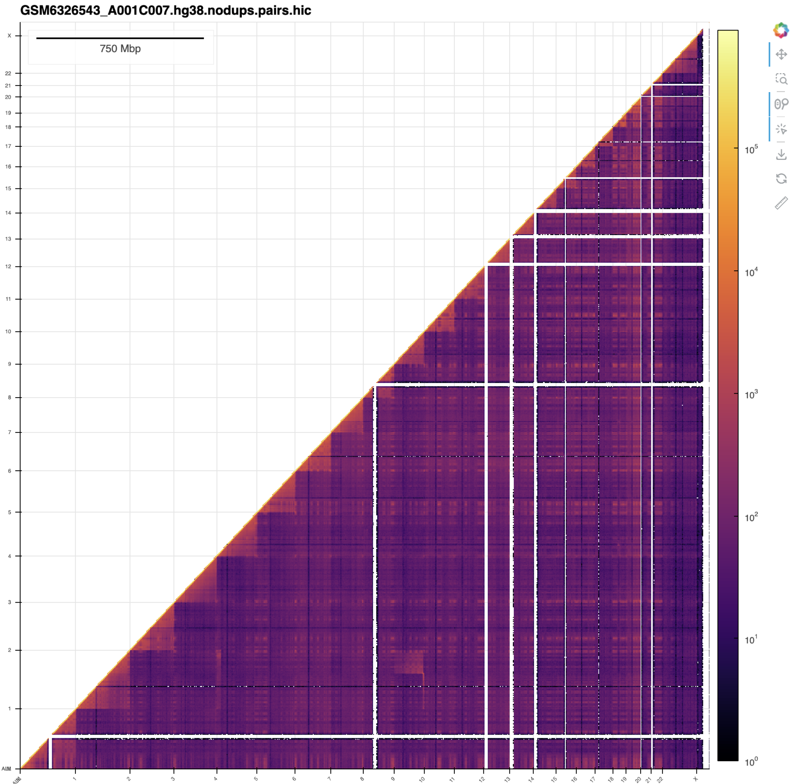

# Conversion from .hic format to hseq

This directory has a small converter to hseq from .hic using the
[straw](https://github.com/aidenlab/straw/) library. The hic format
stores a symmetric matrix, and at the moment the converter only
provides the lower triangle of counts to distinguish from assymetric
matrices.

Usage:

1. Create a conda environment with `environment.yml` and activate it.
2. Download a .hic file. For examlpe, in the series
   [GSE207951](https://www.ncbi.nlm.nih.gov/geo/query/acc.cgi?acc=GSE207951),
   click on "(custom)" in the table at the bottom, check a single .hic
   file, then click the "Download" button. Untar it.
3. Run `python3 hic2hseq.py input.hic output.hseq.gz`
4. In the parent directorie's holoseq environment, run `panel serve holoseq_display.py --show --args --inFile output.hseq.gz --size 1000`

An pre-converted HTAN file for [GSM6326543 is
available(530MB)](https://pub-867b121072f54b4a9eecdf01cd27246b.r2.dev/GSM6326543_A001C007.hg38.nodups.pairs.hseq.gz)

